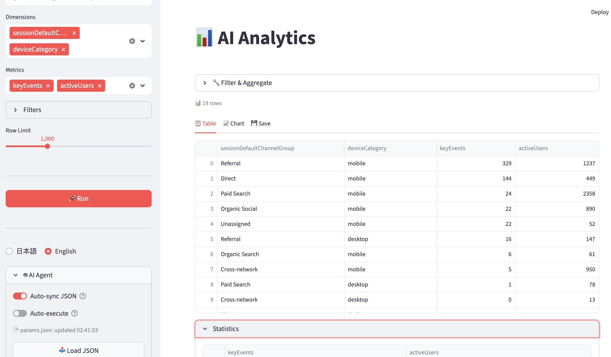

# megaton-app

A toolkit for fetching and analyzing data from GA4, Search Console, and BigQuery.
Three interfaces — **Streamlit UI**, **CLI**, and **Jupyter Notebook** — share the same library, so you can explore interactively and automate with the same code.
AI agents can drive the entire workflow through a simple JSON file, with no MCP server or special protocol required.

## Features

- **AI Agent ready** — File-based integration works with any agent; zero context overhead
- **Streamlit UI** — Browse GA4/GSC/BQ data with filtering, charting, and CSV export
- **CLI** — Run queries from JSON, async jobs, batch execution, and result pipelines
- **Notebook** — Develop analyses interactively, then run them as scheduled jobs



### AI Agent Integration

AI agents (Cursor, Claude Code, GitHub Copilot, etc.) can drive the entire analysis workflow:

```
User: "Show me the organic search trend for the last 7 days"
  ↓
Agent writes input/params.json     ← structured query (schema-validated)
  ↓
Streamlit UI auto-syncs (2s poll)  ← human reviews & adjusts if needed
  ↓
Execute → results displayed        ← auto-execute or manual click
  ↓
Agent reads output/result_*.csv    ← continues analysis in context
```

- **CLI path** — Agents can also bypass the UI entirely: `python scripts/query.py --params input/params.json --json`
- **AGENTS.md** — Project instructions auto-loaded by Cursor / Claude Code / Codex

Unlike MCP-based integrations, this file-based approach requires no server setup, consumes zero agent context for tool definitions, and lets humans review parameters before execution.

## Setup

```bash
pip install -r requirements.txt
# Place service account JSON file(s) in credentials/
```

## Quick Start

```bash
# Streamlit UI
streamlit run app/streamlit_app.py

# CLI
python scripts/query.py --params input/params.json

# Tests
python -m pytest -q
```

## Documentation

| Document | Contents |
|----------|----------|
| [docs/USAGE.md](docs/USAGE.md) | Setup, quick start, recipes, and how-to for Notebook / CLI / Streamlit |
| [docs/REFERENCE.md](docs/REFERENCE.md) | JSON schema, CLI options, pipeline, megaton API, and auth |
| [docs/CHANGELOG.md](docs/CHANGELOG.md) | Change history |

## Structure

```
megaton-app/
├── megaton_lib/        # Shared library (reusable via pip install -e)
├── scripts/            # CLI tools (query.py, run_notebook.py)
├── app/                # Streamlit UI
├── credentials/        # Service account JSON (.gitignore)
├── input/              # AI Agent <-> UI parameter handoff
├── output/             # Query results and job artifacts
├── configs/            # Batch execution JSON configs
├── tests/              # pytest
└── docs/               # Documentation
```

## Related Repositories

| Repository | Role |
|---|---|
| [megaton](https://github.com/mak00s/megaton) | GA4/GSC/Sheets API wrapper (PyPI package) |
| megaton-notebooks | Notebook collection for scheduled reporting (private) |
