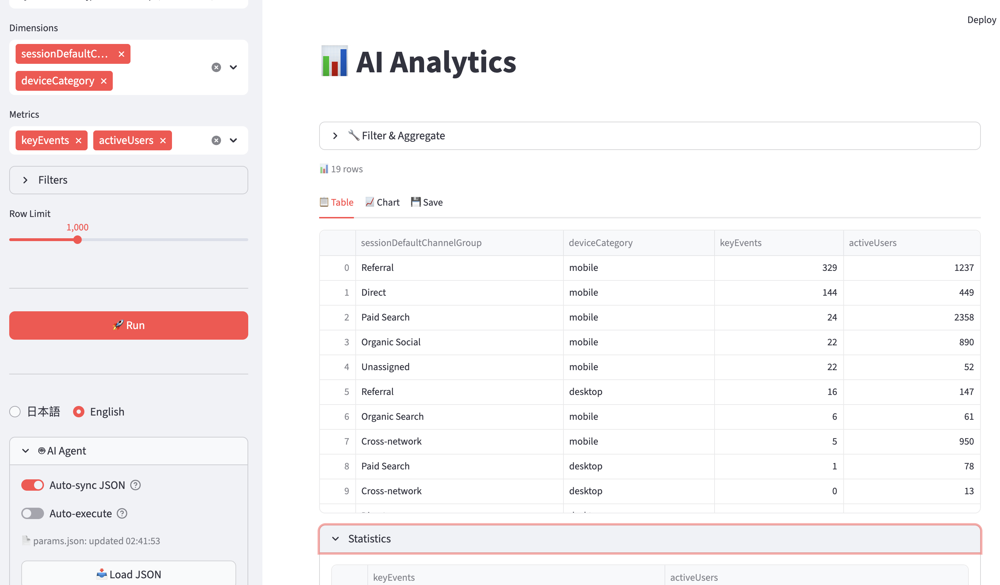

# megaton-app

A toolkit for fetching and analyzing data from GA4, Search Console, Adobe Analytics, and BigQuery.
Three interfaces — **Streamlit UI**, **CLI**, and **Jupyter Notebook** — share the same library, so you can explore interactively and automate with the same code.
AI agents can drive the entire workflow through a simple JSON file, with no MCP server or special protocol required.

## Features

- **AI Agent ready** — File-based integration works with any agent; zero context overhead
- **Streamlit UI** — Browse GA4/GSC/AA/BQ data with filtering, table/chart tabs, and CSV export
- **CLI** — Run queries from JSON, async jobs, batch execution, and result pipelines
- **Audit CLI** — Reusable audits for GTM/Adobe Tags + GA4/AA (`scripts/audit.py`)
- **Validation Helpers** — Shared Playwright / AA validation runners, auth profiles, and follow-up task helpers
- **Adobe Helpers** — Shared OAuth, AA segment listing, classifications export/import/verify, and Data Warehouse scheduling helpers
- **Safer Adobe Tags apply flow** — Export writes `.apply-baseline.json`, apply stays dry-run by default, and stale-base conflicts are blocked before PATCH
- **Notebook** — Develop analyses interactively, then run them as scheduled jobs



### AI Agent Integration

AI agents (Cursor, Claude Code, GitHub Copilot, etc.) can drive the entire analysis workflow:

```
User: "Show me the organic search trend for the last 7 days"
  ↓
Agent writes input/params.json     ← structured query (schema-validated)
  ↓
Streamlit UI auto-syncs (2s poll)  ← human reviews & adjusts if needed
  ↓
Execute → results displayed        ← auto-execute or manual click
  ↓
Agent reads output/result_*.csv    ← continues analysis in context
```

- **CLI path** — Agents can also bypass the UI entirely: `python scripts/query.py --params input/params.json --json`
- **AGENTS.md** — Project instructions auto-loaded by Cursor / Claude Code / Codex

Unlike MCP-based integrations, this file-based approach requires no server setup, consumes zero agent context for tool definitions, and lets humans review parameters before execution.

## Setup

```bash
python --version  # Python 3.11+
pip install -r requirements.txt
# Place Google service-account JSON file(s) in credentials/
# Optional: place Adobe OAuth JSON file(s) in credentials/ too
# Fallback: ADOBE_CLIENT_ID / ADOBE_CLIENT_SECRET / ADOBE_ORG_ID
```

## Quick Start

```bash
# Streamlit UI
streamlit run app/streamlit_app.py

# CLI
python scripts/query.py --params input/params.json

# AA classifications verify
python -m megaton_lib.audit.providers.analytics.verify_classification --company-id wacoal1 --rsid wacoal-all --dimension evar29 --column "関係者" --keys A100012345=社員

# AA Data Warehouse template search
python -m megaton_lib.audit.providers.analytics.dw.cli --company-id wacoal1 --find-template --rsid wacoal-all --name-contains tmpl_step_ --updated-after 2026-01-01T00:00:00Z

# AA follow-up task listing
python scripts/check_pending_verifications.py --all

# Audit CLI (shared 1-9 features)
python scripts/audit.py site-mapping --project example --config-root configs/audit/projects --output output/audit

# Tests
python -m pytest -q
```

## Documentation

| Document | Contents |
|----------|----------|
| [docs/USAGE.md](docs/USAGE.md) | Setup, quick start, recipes, and how-to for Notebook / CLI / Streamlit |
| [docs/REFERENCE.md](docs/REFERENCE.md) | JSON schema, CLI options, audit/validation/AA DW helpers, Target helpers, and auth |
| [docs/VALIDATION.md](docs/VALIDATION.md) | Shared-first validation policy, result schema, thin entrypoint template, follow-up task flow, and detection rule |
| [docs/CHANGELOG.md](docs/CHANGELOG.md) | Change history |

## Site Alias Config (Public Repo Safe)

- Commit only `configs/sites.example.json` (template)
- Keep `configs/sites.json` / `configs/sites.local.json` as local files (gitignored)
- CLI resolves aliases with layered precedence:
  - `sites.example.json` < `sites.json` < `sites.local.json`
- Optional table display hints template: `configs/column_types.example.json`

## Structure

```
megaton-app/
├── megaton_lib/        # Shared library (reusable via pip install -e)
│   ├── megaton_client.py   # GA4/GSC/BQ/AA query execution (core)
│   ├── ga4_helpers.py      # GA4 report helpers
│   ├── gsc_utils.py        # GSC aggregation helpers
│   ├── validation/         # JSON contract and Playwright capture helpers
│   └── audit/              # Reusable audit framework
│       ├── config.py           # Project config model & loader
│       └── providers/
│           ├── adobe_auth.py   # Shared Adobe IMS OAuth
│           ├── analytics/      # AA query/classifications/DW + GA4 audit providers
│           ├── tag_config/     # Adobe Tags & GTM providers (+ sync helpers)
│           └── target/         # Adobe Target Recs/Activities API helpers
├── scripts/            # CLI tools (query.py, run_notebook.py, audit.py)
├── app/                # Streamlit UI
├── credentials/        # Service account JSON (.gitignore)
├── input/              # AI Agent <-> UI parameter handoff
├── output/             # Query results and job artifacts
├── configs/            # Site aliases, batch configs, audit project configs
├── tests/              # pytest
└── docs/               # Documentation
```

## Related Repositories

| Repository | Role |
|---|---|
| [megaton](https://github.com/mak00s/megaton) | GA4/GSC/Sheets API wrapper (PyPI package) |
| megaton-notebooks | Notebook collection for scheduled reporting (private) |

## Audit Scope

- `megaton-app` keeps reusable audit features `1-9` (providers, runner, common tasks, CLI).
- Project-specific audit logic `10-12` stays in each analysis repository.
- See `configs/audit/projects/README.md` for boundaries and config examples.
